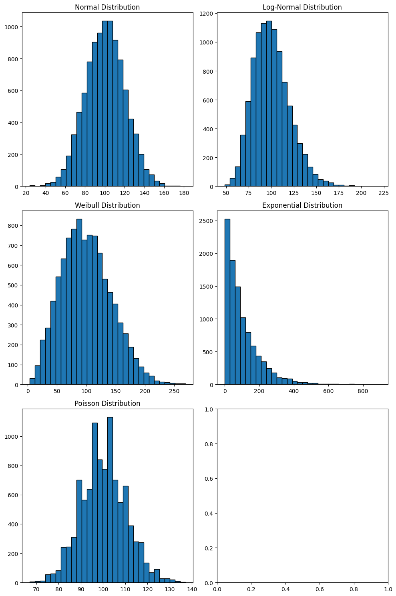

# **SmartCycle Analysis and Visualization Project**

## **Index**
1. [Project Overview](#project-overview)
2. [Project Structure](#project-structure)
3. [Getting Started](#getting-started)
4. [Usage](#usage)
   - [1. Jupyter Notebooks](#1-jupyter-notebooks)
   - [2. Streamlit App](#2-streamlit-app)
5. [Running the Application](#running-the-application)
6. [Solution](#solution)
7. [Future Steps](#future-steps)

## **Project Overview**
This project is designed to analyze and visualize data for the **SmartCycle**, focusing on key metrics like asset loss (shrinkage) and pool sizes at a given time. The application includes a notebook for data exploration and modeling, and a Streamlit-based web app for interactive visualization.

---

## **Project Structure**

```
├── .images/               # Directory for images
├── notebooks/             # Jupyter notebooks with analysis
├── src/                   # Directory contains source code for reusable components
├── streamlit_app/         # Streamlit-based web application for interactive visualization
├── Dockerfile             # Docker instructions for environment setup
├── poetry.lock            # Python dependencies for `Poetry`
├── pyproject.toml         # Python dependencies for `Poetry`
├── README.md              #  Overview of the project, its structure, and how to use it
```

## **Getting Started**

### **Prerequisites**
- Python 3.10+
- Poetry for dependency management
- Docker (optional for containerization)

### **Installation**

1. Clone the repository:
   ```bash
   git clone <repository-url>
   cd rpc-analysis
   ```

2. Build and run the application using Docker:
   ```bash
   docker build -t rpc-analysis-app .
   docker run -it --rm -p 8888:8888 -v ${PWD}:/app rpc-analysis-app
   ```

**OR**

2. Install dependencies using Poetry (Python 3.10 environment):
   ```bash
   poetry install
   ```

3. Run the Streamlit app:
   ```bash
   poetry run streamlit run streamlit_app/home.py
   ```

---

## **Usage**

### **1. Jupyter Notebooks**
- Use `notebooks/solution.ipynb` for data modeling and solution exploration.

### **2. Streamlit App**
- Launch the app with the above command and interact with visualizations for shrinkage and pool size data.
[http://localhost:8501](http://localhost:8501)

---

## **Solution**

Our goal is to: 
- Develop a model to estimate the shrinkage rate, i.e. the probability of an asset not returning from a trip
- Develop a model to estimate the pool size, i.e. the amount of assets available at a given time.

**TL;DR:** We don't have real data, so we will simulate data and fit a survival model to estimate the shrinkage rate and the pool size curve.

### Dataset Creation Overview

To simulate the data we are going to assume that the average duration of a trip is 100 days:
```
mean_trip_duration = 100 days # average duration of a trip
```
We will play with the rest of the parameters in a streamlit app to see different results.
```
distribution_type = ["Normal", "Log-Normal", "Weibull", "Exponential"]
std_trip_duration = 0.2 # standard deviation of the trip duration
pct_lost_trips = 0.05 # percentage of lost trips
```

The distribution of trip durations can vary based on the proximity of stakeholders to the warehouse. For example, if all stakeholders place an equal number of orders and are evenly distributed geographically, we can expect the distribution of trip durations to resemble a normal distribution.

Conversely, if most stakeholders are located near the warehouse while some are situated in other countries, the trip durations will differ significantly. Stakeholders closer to the warehouse, who make up the majority, are likely to experience shorter trip durations. In contrast, those located further away may face longer trips due to increased travel time and logistical challenges. This scenario could be represented by an exponential distribution.

To allow several scenarios we had developed an streamlit-app ready to perform the analysis under different distributions.

We ran several distribution simulations to visualize the impact of different distribution types on trip durations. The following plot illustrates the results of these simulations:

<p style="text-align: center;">
    
</p>

This simulation allows for effective analysis of asset loss and return cycles. For the distribution selected we will create a dataset using the `generate_data` method in the `Data` class, which simulates the rental and return of reusable packaging containers (RPCs) over a specified period. Here’s a brief overview of the key steps involved:

1. **Rental Dates**: Rental dates are generated by adding a random number of days to a specified start date for each trip.

2. **Return Dates**: Corresponding return dates are calculated by adding the trip duration (from the provided distribution) to each rental date.

3. **Trip Returned**: The `trip_returned` variable indicates whether each RPC was returned. This is determined using a binomial distribution, where the probability of return is `1 - pct_lost_trips`. Each trip is assigned a value of `1` (returned) or `0` (not returned).

4. **Trip Durations**: Trip durations are clipped to ensure no negative values, maintaining realistic trip lengths.

5. **DataFrame Population**: The method populates the DataFrame with unique trip IDs, rental dates, return dates, trip durations, and the `trip_returned` status.

If we select a normal distribution, the generated data will have the following format: 

<p style="text-align: center;">
    
</p>

And the histogram will be: 


### Shrinkage model

Now, our next step is to develop a model to estimate the shrinkage rate. 

For that we can study to use two widely used models in survival analysis: the **Cox Proportional Hazards (CoxPH) Model** and the **Kaplan-Meier estimator**. They serve different purposes and are applied in distinct contexts. The next table will give us an overview: 

---

| Feature                     | Kaplan-Meier Estimator                           | Cox Proportional Hazards Model                |
|-----------------------------|-------------------------------------------------|----------------------------------------------|
| **Type of Analysis**        | Non-parametric (descriptive)                    | Semi-parametric (inferential)                |
| **Handles Covariates**      | No                                              | Yes                                          |
| **Output**                  | Survival probabilities over time                | Hazard ratios for covariates                 |
| **Assumptions**             | None                                            | Proportional hazards                         |
| **Complexity**              | Simple                                          | Moderate to High                             |
| **When to Use**             | Visualize survival in groups or overall         | Assess impact of predictors on survival      |

---

Both methods complement each other, but in our first scenario it makes more sense to use `Kaplan-Meier`, a non-parametric method, due to the lack of covariates, having only one variable: `trip_duration`.

Using the Kaplan-Meier model we obtain the following result for a `normal distribution` (u=100 days):


The Kaplan-Meier estimator computes the survival rate by estimating the probability of survival over time, taking into account the duration of trips and whether they were returned or lost.

For our case, we measured the `shrinkage_rate = 1 - survival_rate` at `x = 100 days`, resulting in a `shrinkage_rate` of 0.48 when the RPC has been out of the warehouse for 100 days. This indicates that as the number of days the package remains out increases, the likelihood of it being returned decreases, leading to a higher shrinkage rate.

By changing the distribution type in the `streamlit app`, we can explore the shrinkage model across various trip duration distributions. This will enable us to analyze how the shrinkage rate fluctuates with each distribution type. For instance, with the `exponential model`, the shrinkage rate is higher at 100 days. 


### Pool size model
The pool size model simulates the availability of reusable packaging containers (RPCs) over a specified time period, taking into account rental rates, return probabilities, and shrinkage rates. It tracks the number of assets in the pool, those rented out, those returned, and those lost due to shrinkage.

#### **Simulation Parameters**
```
- Initial Pool Size: 1000 assets
- Daily Rental Rate: 100 assets on day 0
- Shrinkage Rate: Dynamic, based on survival and return probabilities.
```

#### **Simulation Process**

1. **Initialization:**
   - Start with an initial pool size of 1000 assets.
   - On the first day, rent out 100 assets, leaving 900 assets available in the pool.

2. **Daily Simulation Loop:**
   - For each day in the simulation:
     - **Assets Out:** Track the total number of assets rented out but not yet returned.
     - **Return Probability:** Calculate the probability of an asset being returned using the probability density function (PDF) of trip durations.
     - **Survival Rate:** Determine the likelihood of an asset not being lost, using the Kaplan-Meier survival function.
     - **Assets Lost:** Calculate the number of assets lost on the given day based on the shrinkage rate and return probability.
     - **Assets Returned:** Compute the number of assets returned on the given day.
     - **Available Assets:** Update the number of available assets by subtracting rented assets and adding returned assets.

3. **Pool Size Tracking:**
   - Log the available pool size at the end of each day.

#### **Key Calculations**
- **Lost Assets:**
  `lost_today = assets_out * (1 - survival_rate) * return_probability_day`
- **Returned Assets:**
  `returned_today = assets_out * return_probability_day * survival_rate`
- **Available Assets:**
  `available_assets += returned_today - rented_today`

For the normal distribution, we can see how the pool size fluctuates over time in the following graph.


#### **How are Shrinkage Rate and Pool Size Related?**

Shrinkage rate and pool size are closely interconnected, as shrinkage directly impacts the number of reusable packaging containers (RPCs) available in the pool over time. Here’s how they influence each other:

- **High Shrinkage Rate:** More assets are lost, reducing the pool size at a faster rate.
- **Low Shrinkage Rate:** Fewer assets are lost, maintaining a larger pool size over time.

The pool size at any given time is a function of:
- **Assets Rented:** Assets taken out of the pool for use.
- **Assets Returned:** Assets brought back to the pool after use.
- **Assets Lost:** Assets permanently removed from the pool due to shrinkage.

Shrinkage reduces the number of assets returned, thereby decreasing the pool size. Over time, higher shrinkage rates lead to a significant decline in the pool size, which may necessitate purchasing new assets to maintain operations.

#### **How would switching to scenario two change your approach, which limitations would be introduced?**

This scenario drives uncertainty in trip durations and tracking of lost RPCs introducing: 
- Bias in Shrinkage rate estimation. If the missing data is non-random, the shrinkage rate might be over- or under-estimated.
- Less accurate pool size estimation. Uncertainty in rental date measurement propagates to pool size estimation

Our approach will shift: 
- Impute missing rental dates using historical averages or observed patterns.
- Use simulations (e.g., Monte Carlo) to estimate pool size distribution, accounting for missing data uncertainty

## **Future steps**
   - Add covariates to the data, like type (size) of package, country, in order to implement parametric-models: 
        * CoxPH model 
        * Classical ML classification models: predicting if the trip will return or no, etc
   - Evaluate the methodology with real-world data
